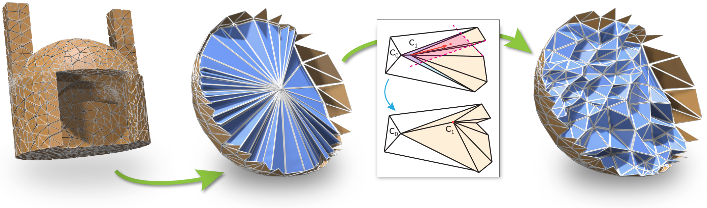

# Expansion Cones: A Progressive Volumetric Mapping Framework

[Valentin Z. NIGOLIAN](https://cgg.unibe.ch/) (valentin.nigolian@gmail.com), [Marcel CAMPEN](http://graphics.cs.uos.de/), [David BOMMES](https://cgg.unibe.ch/)
ACM Transaction on Graphics (Proceedings of SIGGRAPH 2023)


Our method generates a bijective map of a ball-topology tetrahedral mesh (a) to a star-shaped domain, e.g. a ball (b). Starting with all interior vertices
clustered inside the domain’s kernel (b), we iteratively split clusters by picking a subset of vertices whose 1-ring neighborhood union has a non-empty kernel.
By moving this subcluster into this kernel, some initially degenerate tetrahedra are expanded (c), without degenerating or inverting others. Repeating this
until no cluster remains, all tetrahedron images obtain positive volume, yielding a bijective map (d). Mesh refinement is applied adaptively in the process to
obtain the necessary degrees of freedom. A key invariant is that the intermediate maps never invert any tetrahedron

[`Project Page`](https://www.algohex.eu/publications/expansion-cones/)
[`Dataset`](https://zenodo.org/records/8304643)
[](https://zenodo.org/doi/10.5281/zenodo.10039967)

## Abstract
Volumetric mapping is a ubiquitous and difficult problem in Geometry Processing and has been the subject of research in numerous and various directions. 
While several methods show encouraging results, the field still lacks a general approach with guarantees regarding map bijectivity. 
Through this work, we aim at opening the door to a new family of methods by providing a novel framework based on the concept of _progressive expansion_.
Starting from an initial map of a tetrahedral mesh whose image may contain degeneracies but no inversions, we incrementally adjust vertex images to expand degenerate elements. 
By restricting movement to so-called _expansion cones_, it is done in such a way that the number of degenerate elements decreases in a strictly monotonic manner, without ever introducing any inversion. 
Adaptive local refinement of the mesh is performed  to facilitate this process.
We describe a prototype algorithm in the realm of this framework for the computation of maps from ball-topology tetrahedral meshes to convex or star-shaped domains.
This algorithm is evaluated and compared to state-of-the-art methods, demonstrating its benefits in terms of bijectivity.
We also discuss the associated cost in terms of sometimes significant mesh refinement to obtain the necessary degrees of freedom required for establishing a valid mapping.
Our conclusions include that while this algorithm is only of limited immediate practical utility due to efficiency concerns, the general framework has the potential to inspire a range of novel methods improving on the efficiency aspect.


## Building

`expansion-cones` uses `cmake` for compilation.

### Requirements
This project assumes that [CGAL](https://www.cgal.org/) (used for LP-solving and rational numbers representation) is installed on your machine and can be found with  `find_package`

It also relies on [OpenVolumeMesh](https://www.graphics.rwth-aachen.de/software/openvolumemesh/) for everything mesh-related and [Eigen3](https://eigen.tuxfamily.org/index.php?title=Main_Page) because, well, it's Eigen.
Both of those are downloaded and integrated into the project with cmake's `FetchContent` command so no need to pre-install them.

## Usage

The project generates an executable called `ShrinkAndExpand`. Its usage is:

    ./ShrinkAndExpand [domain_mesh] [output_file] [function_index] [boundary_mapping] [option]
    
Where `function_index` defines the main behaviour of the executable. If it's 0, it runs the Shrink-and-Expand method on the given input. If it's 1, it generates the boundary conditions described in the ''Dataset'' section of the paper.

The parameters have different meaning depending on `function_index`, as described below:

|  name          | description                                                                                                                                                                                                                 | `function_index`=0                                                                                                                                                                                                          | `function_index`=1                                                                                                                                               |
|----------------|-----------------------------------------------------------------------------------------------------------------------------------------------------------------------------------------------------------------------------|-----------------------------------------------------------------------------------------------------------------------------------------------------------------------------------------------------------------------------|------------------------------------------------------------------------------------------------------------------------------------------------------------------|
|  `input_mesh`   <td colspan=3>  Your domain `.ovm` mesh to map.  To obtain a `.ovm`(OpenVolumeMesh) file, you can convert your mesh using Martin Heistermann's [fork]( https://github.com/mheistermann/meshio) of [meshio](https://pypi.org/project/meshio/)                  |
| `boundary_mapping`  | Defines the map's boundary conditions                                                                                                                                                                                       | A `.txt` file containing the per-boundary-vertex prescribed codomain positions.                                                                                                                                             | A single digit as follows. 1: Tetrahedral boundary, 2: Stiff Tetrahedral boundary, 3: Spherical boundary, 4: Random Star-shaped boundary (see paper for details) | 
|  `output_file`  | Output of the executable.                                                                                                                                                                                                   | The codomain mesh mapped by Shrink-and-Expand, matching the boundary conditions given as argument. (see below for details). It also creates a `.json`  file in the same directory, containing data on the expansion process | The path to a `.txt` file containing the boundary conditions corresponding to the given boundary type                                                            |
| `option`   <td colspan=3>  Function-dependent option (0 by default). Please run `ShrinkAndExpand` without any argument for details.                                                                                                                    |                                                                                                                                                                                                                             |                                                                                                                                                                  |

More information can be found by running `ShrinkAndExpand` without any argument.

### Boundary Conditions

The boundary conditions are generated (and read) as `.txt` files structured as follows:
```` 
v0 pos0x pos0y pos0z 
v1 pos1x pos1y pos1z
:
vn posNx posNy posNz
````
Where `v0, v1,... vN` are the indices of the boundary vertices of the mesh. 

Note that my parser for those files is not very robust so don't throw any garbage in there!


### Codomain Mesh Output

The codomain mesh generated by the `ShrinkAndExpand` executable is stored in the .ovm format, with its domain and codomain positions stored as OVM [properties](https://www.graphics.rwth-aachen.de/media/openvolumemesh_static/Documentation/OpenVolumeMesh-Doc-Latest/concepts.html#generic_properties).
The `.ovm` file basically contains a list of per-vertex (domain and codomain) positions, each stored as a single string
You can look at how those strings are parsed in [my code](https://github.com/cgg-bern/expansion-cones/blob/c41b15313375857089f9f372880558a1a6087bfd/src/ProgEmbeddingHelpers.cc#L141) in case you need it to parse it yourself.

In addition to the ccodomain mesh, the executable generates a `.json` files containing a bunch of information on how the Shrink-and-Expand process went.
It would probably be too long to explain everything here so if you're interested, don't hesitate to write me an e-mail.


